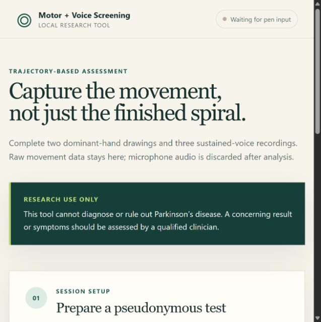
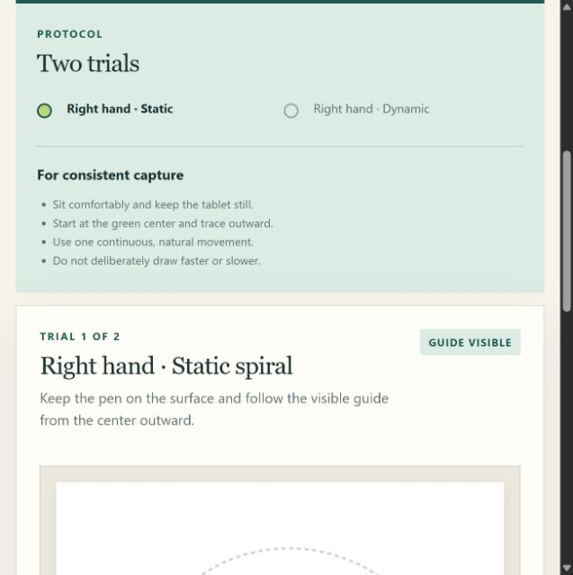

# Parkinson's spiral motor-screening research tool

This project is a reproducible starting point for **research into screening**, not a
Parkinson's diagnostic tool. A spiral cannot establish Parkinson's disease, and the
model output is deliberately called a `screening_score`, not a probability of disease.
Diagnosis requires a clinician and consideration of alternative causes such as
essential tremor, medication effects, arthritis, injury, stroke, and other movement
disorders.

## Application preview

The local web interface guides a pseudonymous participant through dominant-hand
spiral capture and sustained-vowel recording. It never presents either model score as
a diagnosis or disease probability.



The primary protocol uses only the participant's dominant hand: one static tracing
and one dynamic freehand spiral.



## Recommended approach

Do not match a new drawing to one "healthy" and one "Parkinson's" prototype. People
vary too much, and many conditions affect handwriting. Train on many clinician-labeled
participants and keep every drawing from the same person in the same data split.

Prefer the complete drawing trajectory over a final image. Record at least:

- x/y coordinates and timestamps (60 Hz or faster if the device supports it)
- pressure and stylus tilt/angle when available
- pen-up/pen-down state, pauses, speed, acceleration, and task completion time
- the dominant writing hand and repeated attempts; treat the opposite hand as a
  separate optional research task rather than part of the primary score
- a traced Archimedean spiral plus a freehand spiral
- device model, screen/paper size, instructions, medication state, and time of day

Useful complementary tasks include finger tapping, sustained voice, gait/turning,
and a short clinician-approved symptom questionnaire. If this progresses beyond a
technical demo, include people with essential tremor and other Parkinson-like
conditions—not only healthy controls—because that is the clinically difficult test.

If only finished scans or phone photographs are available, first standardize page size,
camera distance, lighting, pen color, and the printed template. Rectify perspective,
separate the participant's stroke from the template, and start with geometric features
plus a small regularized classifier. Split by participant *before* augmentation. A CNN
can be compared later, once there are hundreds to thousands of independent participants;
on a tiny image set it is likely to learn scanner, paper, or site artifacts.

## What is implemented

The project now includes a complete local research workflow:

- a pen-tablet web interface using standard Pointer Events
- static and blinking-template spiral trials with the dominant hand
- three local sustained-"ah" recordings with raw audio discarded after extraction
- a separate participant-level voice model trained on labeled raw sustained-/a/ audio
- x/y trajectory, timestamp, pressure, tilt, device type, and stroke capture
- automatic checks for duration, sample count, drawing size, and spiral turns
- pseudonymous local sessions in SQLite with detailed PDF reporting and deletion
- participant-level feature extraction, model training, scoring, and model artifacts
- an API, command-line interface, automated tests, and clinical-validation protocol

The web application requires one valid dominant-hand static/dynamic pair. It reports
the spiral and voice signals separately; it does not average them into a purported
disease probability.

Both modalities use `0.75` as the conservative elevated-signal decision boundary.
This boundary is not a confidence level or an estimated 75% chance of disease.

## Model baseline

The code uses the public UCI ParkinsonHW trajectory dataset (dataset 395), containing
62 people with Parkinson's and 15 controls. It extracts normalized, interpretable
features from static and blinking-template spiral tasks: speed variability, pauses,
pressure variability, spiral tightness, deviation from an Archimedean spiral,
backtracking, and exploratory 4–7 Hz residual power. It then fits a regularized,
class-balanced logistic regression.

Evaluation is five-fold and participant-level. No trajectory or augmented copy from a
participant can appear in both training and validation. Because the cohort is very
small and the class prevalence is artificial, the resulting score is not clinically
calibrated and must not be presented as an individual's likelihood of Parkinson's.

## First-time setup

Python 3.11–3.13 is supported.

```powershell
py -3.13 -m venv .venv
.venv\Scripts\python -m pip install -e ".[dev]"
.venv\Scripts\spiral-pd download
.venv\Scripts\spiral-pd train
.venv\Scripts\spiral-pd train-voice --download
.venv\Scripts\python -m pytest
```

## Connect and use the drawing tablet

1. Connect the tablet and install its manufacturer's current driver.
2. On Windows, enable **Windows Ink** in the tablet driver so the browser receives
   pressure and tilt through standard pen events.
3. Start the local application:

   ```powershell
   .venv\Scripts\spiral-pd serve
   ```

4. Open [http://127.0.0.1:8000](http://127.0.0.1:8000). The status changes to
   **Pen detected** after the first pen contact.
5. Use a pseudonymous participant code, complete the two dominant-hand spiral trials,
   then make three six-second sustained-"ah" recordings. Download the detailed PDF
   report from the result screen.

During drawing, verify that the interface reports `pen` input, an effective sampling
rate of at least 40 Hz, and a pressure range that changes as force changes. Fixed
pressure usually means Windows Ink or tablet pressure support is disabled. Mouse and
touch captures are demonstration-only.

The service binds to `127.0.0.1` by default, so other computers cannot access it. Local
sessions are stored in `data/local/sessions.sqlite3`. Use the on-screen delete control
to remove a session and its raw points.

Browser microphone recordings use the installed FFmpeg executable for local WebM/Opus
decoding. Raw audio is processed in memory and is not written to SQLite or included in
reports; only acoustic features, quality measurements, and research scores are retained.

The PDF report includes capture-quality checks, per-recording pitch, jitter, shimmer,
harmonicity and spectral measurements, spiral trajectory metrics, strongest model
contributions, cross-validation performance, dataset provenance, and limitations. The
raw JSON endpoint remains available to approved research workflows, but it is not the
primary user-facing export.

Outputs are written to `artifacts/`:

- `metrics.json`: cross-validation metrics and bootstrap intervals
- `cross_validation_predictions.csv`: one out-of-fold score per participant
- `feature_coefficients.csv`: inspectable standardized model coefficients
- `model.joblib`: final research model fit to all available participants

Voice artifacts are written to `artifacts/voice/`. The deployed baseline uses the
CC BY 4.0 [Figshare sustained-/a/ collection](https://doi.org/10.6084/m9.figshare.23849127.v1):
81 independent participants (40 Parkinson's and 41 controls) recorded on personal
telephones. Training and live inference use the same 42-feature extractor and common
8 kHz telephone passband. Five-fold participant-level cross-validation reached ROC-AUC
0.781. At the conservative 0.75 boundary, specificity was 0.951 and sensitivity was
0.275. The stricter rule reduces
false alarms but misses many labeled cases, so a lower result cannot rule out disease.
Out-of-domain voice inputs are shown as **Unable to score safely**, never as an
extrapolated numeric result.

## Additional online datasets

The CLI includes a provenance-aware catalog of online sources:

```powershell
.venv\Scripts\spiral-pd datasets
```

NewHandPD is integrated as a separate static-image feature benchmark. It contains 66
participants (31 Parkinson's, 35 controls) and four spiral images per participant. The
download is kept out of Git, a local source manifest is created, and cross-validation is
grouped by participant:

```powershell
.venv\Scripts\spiral-pd download-newhandpd
.venv\Scripts\spiral-pd benchmark-newhandpd
```

Its outputs are written to `artifacts/newhandpd/`. On the current reproducible run, the
66-participant benchmark reached ROC-AUC 0.943, sensitivity 0.968, and specificity 0.800.
This uses image-derived features supplied with the dataset and is intentionally not
deployed in the live tablet application: paper scans and the BiSP smart pen are a
different acquisition domain from browser Pointer Events.

The [official NewHandPD/HandPD page](http://wwwp.fc.unesp.br/~papa/pub/datasets/Handpd/)
provides research downloads but does not post an explicit data license. Confirm reuse
terms with the authors before redistribution, commercial use, or public deployment.

PaHaW contains dynamic tablet handwriting from 37 Parkinson's participants and 38
controls, but access requires a signed, institutional, noncommercial research agreement.
Review the [official PaHaW license](https://bdalab.utko.fekt.vut.cz/wp-content/uploads/2016/05/PaHaW_licence_agreement.pdf);
do not use third-party reposts to bypass its terms.

The Cc-PhD research dataset is especially valuable because it includes Parkinson's,
essential tremor, and healthy controls, but it requires an academic application through
the [authors' access repository](https://github.com/dreamhcy/MLforPD_DataSet).

To exercise the scorer with a seven-column UCI-format trajectory file:

```powershell
.venv\Scripts\spiral-pd predict path\to\participant.txt
```

See [the fixed collection and validation protocol](docs/DATA_COLLECTION_AND_VALIDATION.md)
before collecting study data.

## Before any clinical or public use

1. Write a fixed data-collection protocol and exclusion criteria with a movement-
   disorder clinician.
2. Obtain ethics/privacy approval and informed consent for identifiable health data.
3. Collect a larger age-matched, sex-balanced, multi-device, multi-site cohort with
   neurologist-confirmed labels and clinically relevant differential diagnoses.
4. Reserve an untouched external site/device as the final test set. Report sensitivity,
   specificity, ROC-AUC, PR-AUC, calibration, confidence intervals, and subgroup results.
5. Select a threshold from the intended screening pathway and disease prevalence;
   validate prospectively. Do not choose it from the external test set.
6. Route positive, uncertain, and symptom-concerning screens to qualified clinical
   assessment. The application already rejects insufficient capture quality, but that
   quality logic also requires prospective validation.

The UCI data is CC BY 4.0. Cite: Isenkul, Sakar, and Kursun, *Parkinson Disease
Spiral Drawings Using Digitized Graphics Tablet*, UCI Machine Learning Repository,
[DOI 10.24432/C5Q01S](https://doi.org/10.24432/C5Q01S).

## Research background

- [Digitized Spiral Drawing: A Possible Biomarker for Early Parkinson's Disease](https://pmc.ncbi.nlm.nih.gov/articles/PMC5061372/)
- [Screening of Parkinson's Disease Using Geometric Features Extracted from Spiral Drawings](https://pmc.ncbi.nlm.nih.gov/articles/PMC8533717/)
- [Tablet drawing plus symptom information in movement-disorder assessment](https://pmc.ncbi.nlm.nih.gov/articles/PMC10293248/)
